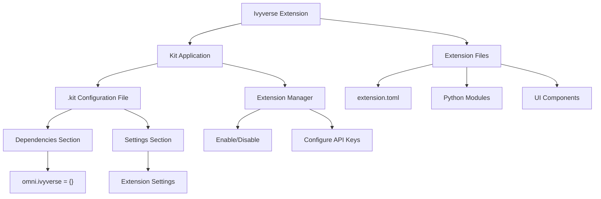

# Extension Integration Overview



## File Structure

```
kit-extension-ivyverse/
├── docs/
│   └── ADDING_TO_APPLICATION.md    # This guide
├── exts/
│   └── omni.ivyverse/
│       ├── config/
│       │   └── extension.toml      # Extension configuration
│       └── omni/
│           └── ivyverse/
│               ├── extension.py    # Main extension class
│               ├── window.py       # UI window
│               ├── llm_manager.py  # LLM integration
│               └── scene_analyzer.py # USD scene analysis
└── README.md                       # Main documentation

kit-app-template/
├── templates/
│   └── apps/
│       ├── kit_base_editor/
│       │   └── kit_base_editor.kit  # App configuration
│       └── usd_viewer/
│           └── usd_viewer.kit       # App configuration
└── exts/                           # Extensions folder (symlinks here)
```

## Integration Flow

1. **Development Phase**:
   - Create extension in `kit-extension-ivyverse`
   - Link to `kit-app-template/exts/`
   - Test with standalone scripts

2. **Integration Phase**:
   - Choose target application (.kit file)
   - Add extension to dependencies
   - Configure settings

3. **Runtime Phase**:
   - Kit loads .kit configuration
   - Resolves dependencies
   - Loads Ivyverse extension
   - UI appears in Omniverse

4. **Usage Phase**:
   - User configures API keys
   - Loads USD scenes
   - Interacts with Ivyverse chat
